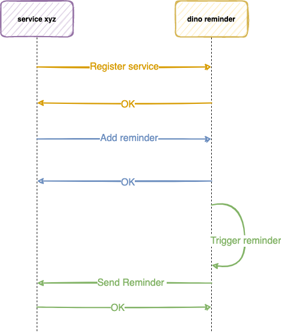

# Reminder Service

- [Reminder Service](#reminder-service)
  * [Description](#description)
  * [Documentation](#documentation)
    + [Specs](#specs)
      - [Rpc calls](#rpc-calls)
    + [How to add a service](#how-to-add-a-service)
    + [How to add a reminder](#how-to-add-a-reminder)
    + [Receive reminder in the registered service](#receive-reminder-in-the-registered-service)
      - [Reminder status](#reminder-status)
    + [List Reminders](#list-reminders)
  * [Non functional requirements](#non-functional-requirements)
  * [Definition of Done](#definition-of-done)
  * [Infraestructure](#infraestructure)

## Description

Does your service need to be reminded? This might help it to never forget.



The simple idea of Reminder Service is to let other services know about something. The only requirement at the moment is that any service which wants to make use of Reminder Service has to have an endpoint to accept incoming reminders.

## Documentation

### Specs

All operations are gRPC, having said that all status code are coming from the [gRPC convention](https://github.com/grpc/grpc/blob/master/doc/statuscodes.md)

#### Rpc calls

- Register: Register a service to start accepting reminders
- CreateReminders: Creates a list of reminders for a registered service
- ListReminders: Get all reminders that fulfil the criteria

[More information about the rpc calls and messages](docs/proto.md)

### How to add a service

Services that wants to be added to Reminder Service can do so by calling `Register`.
When calling `Register`, Reminder Service will try to see if the endpoint defined by the Service which is being registered exists or not.

To ping the endpoint a fake [reminder request](#receive-reminder-in-the-registered-service) will be created and sent.

If there is no endpoint, or it isn't reachable then the service won't be able to be registered returning

```scala
val metadata = new MetadataBuilder()
  .addText(s"$endpointError", "$error")

GrpcServiceException(Status.FAILED_PRECONDITION, metadata)
```

- `$endpointError` should be the submitted endpoint
- `$error` should be the response that was received by trying to verify if the endpoint exists

`Register` is meant to be idempotent which calling it more than once won't fail.

### How to add a reminder

A reminder is unique. Meaning it can be only one reminder with that ID/Name per service.  
Having said that, when one of the reminders in the list already exists then none of them will be created and the following response will be returned.

```scala
val metadata = new MetadataBuilder()
  .addText(s"$reminderId", "already exists")

GrpcServiceException(Status.ALREADY_EXISTS, metadata)
```

The reminder accepts to have optional data, this data can't exceed 64 KB. It's a reminder not a book. If it exceeds the limit then the following response will be returned.

```scala
val metadata = new MetadataBuilder()
  .addText(s"$reminderId", "exceeds 64KB data limit")

GrpcServiceException(Status.FAILED_PRECONDITION, metadata)
```

### Receive reminder in the registered service

Once the reminder is triggered Reminder Service will send it via the endpoint defined in the service registration.

Sending a reminder is done via http calls which is convenient and flexible, but it has some drawbacks.

One of them would be, if the service which the reminder is sent doesn't respond with a `200 OK` then
Reminder Service will retry in a backoff fashion up to the time define in the `Register` request and then mark it as `UNDELIVERED`.

The http request from the Reminder Service to the Registered service is:

```bash
curl -XPOST $endpoint -H 'Content-Type: application/json' \
  -d '{"reminder_id":"<reminder id>","sent_at":"<timestamp in UTC>","attempt":1,"data":"<byte string>"}'
```

- reminder_id: The reminder id sent in `CreateReminderRequest`
- sent_at: Timestamp in UTC when the request was created in the first attempt. If there is multiple attempts this value should be of the first one and never changed.
- attempt: Number of attempts (1 index based)
- data: The data sent in `CreateReminderRequest`

#### Reminder status

- `SCHEDULED`: A reminder has been scheduled and will be triggered in the futureService
- `DELIVERED`: A reminder has been triggered and sent to the registered service
- `UNDELIVERED`: A reminder has been triggered but couldn't be sent to the registered service

### List Reminders

`ListReminders` returns a stream of all reminders that fulfil the request criteria. The list can be filtered by `reminder_ids`, `service_ids` and/or `status`. If there is no filters then all reminders are returned.

## Non functional requirements

- The database doesn't need to be multi tenant.
- The service should be able to scale out

## Definition of Done

- All provided tests should pass
- All the rpc calls must be implemented
- Code should be as legible as possible
- Follow best practices

## Infraestructure
[Docker compose](https://docs.docker.com/compose/install/) is used to create:
- [MockServer](https://www.mock-server.com/) instance using `initializerJson.json` config to expose an invalid and invalid endpoint.
- MySQL instance to persist Quartz jobs and everything that you might need

## Design decisions

- DDD, event sourcing and CQRS were used in this service. It was implemented using: 
    - Akka Persistence Typed (event sourcing + modelling the aggregates) with Akka Cluster Sharding (to ensure horizontal scalability). This covers the command side / write side.
    - Akka Projections for the read side. The reminder projection is distributed using multiple event tags and a sharded daemon.
    - Quartz projection uses Cluster Singleton to ensure that only a schedule will be triggered once and only once.
    - The event storage used is mysql for convenience. In a production environment a NoSQL database like Cassandra could be a better choice (horizontal scalability). Though it has its problems. The projections can only be ALOD (at least once delivery) and not exactly once. This decision depends on the specific business / scalability needs. 